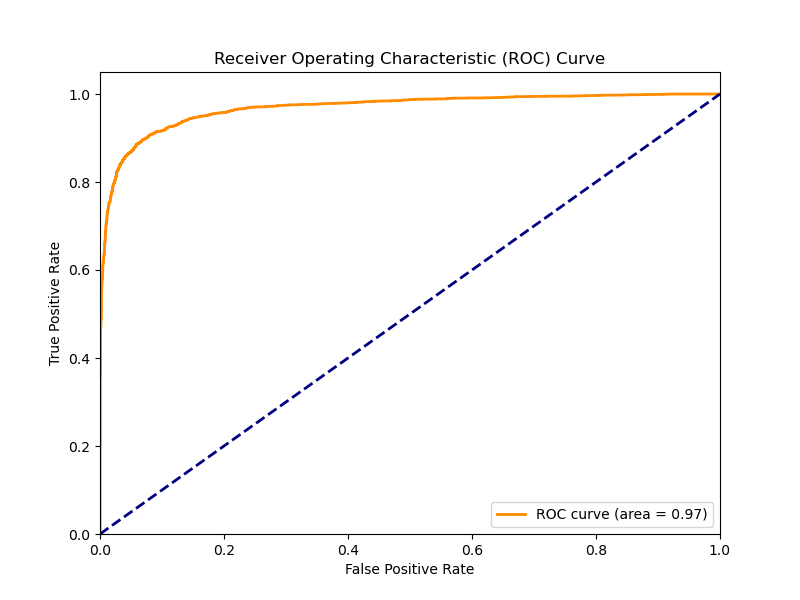
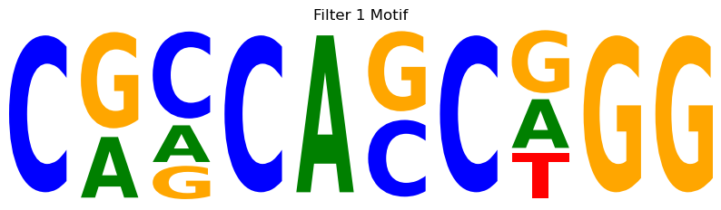

# Deep Learning for DNA Sequence Classification: Predicting CTCF Binding Sites

## Project Overview
This repository presents a deep learning project focused on predicting Transcription Factor Binding Sites (TFBSs) for the **CTCF** (CCCTC-binding factor) protein in the human genome. The project demonstrates the application of Convolutional Neural Networks (CNNs) to DNA sequence data, showcasing skills in genomic data acquisition, preprocessing, deep learning model development, evaluation, and interpretation.

## Goals of this Project
The primary goals of this project were to:
* Build a deep learning model to accurately predict whether a given DNA sequence is a CTCF binding site (binary classification).
* Gain hands-on experience with the entire deep learning pipeline in bioinformatics, from raw data to model interpretation.
* Demonstrate proficiency in PyTorch for neural network development.
* Showcase skills in genomic data handling, feature engineering, and interpreting model insights in a biological context.

## Key Findings

* **High Prediction Accuracy:** The trained CNN achieved a **Test Accuracy of 91.19%** on unseen DNA sequences, indicating strong overall performance in classifying CTCF binding sites.
* **Robust Classification Performance:**
    * **Precision (0.9124):** When the model predicted a sequence as a CTCF binding site, it was correct over 91% of the time, demonstrating a good ability to minimize false positives.
    * **Recall (0.9111):** The model successfully identified approximately 91% of all actual CTCF binding sites in the test set.
    * **F1-Score (0.9117):** This balanced metric reflects a great overall performance in identifying binding sites.
    * **ROC AUC (0.9680):** The Receiver Operating Characteristic Area Under the Curve (ROC AUC) score of 0.9680 confirms the model's strong discriminative power between binding and non-binding sequences.
* **Learned DNA Motifs:** Analysis of the first convolutional layer's filters revealed learned DNA sequence patterns (motifs). Several of these learned motifs visually resemble known CTCF binding consensus sequences, suggesting the model successfully identified biologically relevant features for prediction. For example, Motif 1 (shown below) displays a strong preference for C and G bases, particularly a G-rich region towards the 3' end, which is consistent with known characteristics of CTCF binding sites.  

## Computational Environment Setup
* **Operating System:** macOS (Apple M4 chip, 16GB RAM).
* **Conda:** Utilized Miniconda for environment management.
    * Channels configured: `conda-forge`, `bioconda`, `defaults` (with strict priority).
    * **`bioinfo_general` environment:** Python 3.9, `pytorch` (with MPS support), `numpy`, `scikit-learn`, `matplotlib`, `seaborn`, `bedtools`, `samtools`, `logomaker`.
* **PyTorch:** Primary deep learning framework, leveraging Apple's Metal Performance Shaders (MPS) for GPU acceleration on the M4 chip.
* **Development Environment:** VS Code for script development and integrated terminal execution.

### **Key Troubleshooting Overcome**
This project involved navigating several significant computational and data challenges:
* **`bedtools getfasta -tab` Parsing:** Addressed the specific format of `bedtools getfasta` output (ID and sequence on one tab-separated line without `>`) by adjusting the custom `DNADataset` parser.
* **`DataLoader` `TypeError`:** Resolved a `TypeError` related to `torch.utils.data.ConcatDataset` and `__getitem__` by refactoring `DNADataset` to load multiple FASTA files directly, bypassing `ConcatDataset`.
* **Missing Python Packages:** Successfully installed `scikit-learn`, `matplotlib`, and `seaborn` to enable model evaluation and plotting.
* **Resource Management:** Effectively managed 16GB RAM for deep learning tasks by optimizing batch sizes and leveraging MPS acceleration.
* **GitHub Large File Limits:** Overcame GitHub's 100MB file size limit (and Git LFS 2GB limit) by carefully configuring `.gitignore` and `.gitattributes` to exclude the very large `hg38.fa` reference genome and the derived `negative_sequences.fasta` file, providing instructions for their local acquisition/regeneration instead.

## Data Acquisition
* **CTCF ChIP-seq Narrow Peaks (Positive Examples):** Acquired `ENCFF356LIU.bed.gz` (unzipped to `ENCFF356LIU.bed`) from the ENCODE Project, representing validated CTCF binding sites in GM12878 cells (hg38 assembly).
* **Human Reference Genome (`hg38.fa`):** This file (~3.1 GB) exceeds GitHub's Git LFS individual file size limit (2 GB) and is not directly hosted in this repository. Please download it manually from the UCSC Genome Browser and place it in the `data/raw/` directory.
* **Human Chromosome Sizes (`hg38.chrom.sizes`):** Downloaded from UCSC Genome Browser.
* **Negative Sequence Generation:** The `negative_sequences.fasta` file is a large, derived file and is not directly stored in the repository. It is generated using `bedtools random` to generates 1 million random 200 bp genomic regions, which are then filtered using `bedtools intersect -v` to ensure no overlap with known CTCF sites. `bedtools getfasta` extracts these sequences.

## Analysis Workflow
The analysis was performed using Python within a dedicated Conda environment, leveraging PyTorch for deep learning.

1.  **Data Preprocessing:**
    * **Unzipping and Indexing:** Raw gzipped files (`.bed.gz`, `.fa.gz`) are unzipped, and the `hg38.fa` file is indexed using `samtools faidx`.
    * **Positive Sequence Extraction:** `bedtools getfasta` is used to extract 200 bp DNA sequences centered around each CTCF peak from `ENCFF356LIU.bed`, using `hg38.fa`.
    * **Negative Sequence Generation:** `bedtools random` generates 1 million random 200 bp genomic regions, which are then filtered using `bedtools intersect -v` to ensure no overlap with known CTCF sites. `bedtools getfasta` extracts these sequences.
    * **DNA Encoding & DataLoaders:** A custom `DNADataset` class (defined in `scripts/data_preparation.py`) handles loading, one-hot encoding (converting A, C, G, T into numerical vectors), sequence padding/truncation, and balancing of positive and negative examples. `DataLoader` objects are created to efficiently batch, shuffle, and load data for training, validation, and testing.

2.  **Deep Learning Model Building & Training:**
    * **Model Architecture:** A Convolutional Neural Network (`DNAClassifier`, to be defined in `scripts/model_training.py`) is used. This CNN typically consists of 1D convolutional layers (to learn DNA motifs), ReLU activations, max pooling, dropout for regularization, and fully connected layers ending with a sigmoid activation for binary classification.
    * **Training Setup:** Binary Cross-Entropy Loss (`nn.BCELoss`) and the Adam optimizer (`optim.Adam`) will be used. The model will leverage Apple's MPS device for GPU acceleration.
    * **Training Loop:** The model will be trained for a set number of epochs, with performance monitored on a validation set.
    * **Model Saving:** The trained model's state dictionary will be saved to `data/models/dna_classifier_ctcf.pth`.

3.  **Model Evaluation:**
    * The trained model will be evaluated on a held-out test set.
    * Key classification metrics calculated: Accuracy, Precision, Recall, F1-Score, and ROC AUC.
    * An ROC curve plot will be generated and saved to `results/roc_curve.png`.

4.  **Model Interpretation:**
    * The trained model will be loaded, and the weights from the first convolutional layer will be extracted.
    * These weights will be converted into Position Frequency Matrices (PFMs).
    * The `logomaker` library will be used to visualize these PFMs as sequence motif logos, providing insights into the DNA patterns learned by the CNN.

## Results

* **ROC Curve:**  
   
* **Learned Motif Example:**  
    

## Contact
Atharva Bandekar
[LinkedIn](https://www.linkedin.com/in/atharva-bandekar/)

## Declarations
As I am new to computational biology, I have used AI (Google Gemini) in an assistive capacity to provide conceptual guidance and aid with script snippets. Additionally, I also used AI (Google Gemini), to help strcuture the generate markdown code for this README.md file.

All code execution, problem-solving, and learning was performed by myself, Atharva Bandekar.
